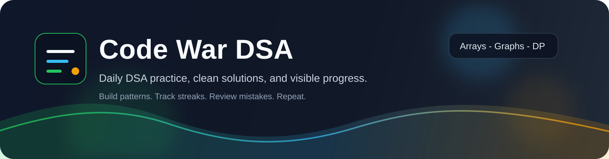

# Code War DSA

A clean, organized DSA practice repo for daily problem solving, pattern notes, and interview-ready revisions.

## What this repo is for

- Solve at least one DSA problem a day.
- Keep solutions grouped by topic so they are easy to revisit.
- Record the pattern, edge cases, and mistakes for each problem.
- Build a visible streak of progress on GitHub.

## Repo map

| Area | Purpose | Start here |
| --- | --- | --- |
| Python OOP practice | Separate area for Python basics and OOP exercises | [python-oop-basics/README.md](python-oop-basics/README.md) |
| Topic library | Solutions grouped by DSA pattern | [problems/README.md](problems/README.md) |
| Daily logs | One note per practice day | [daily-log/README.md](daily-log/README.md) |
| Problem template | Use before solving a new question | [templates/problem-template.md](templates/problem-template.md) |
| Solution template | Keep your write-up consistent | [templates/solution-template.md](templates/solution-template.md) |

## Suggested daily flow

1. Pick one topic folder under [problems](problems/README.md).
2. Solve the problem in your preferred language.
3. Add a short explanation and complexity analysis.
4. Capture mistakes or follow-up ideas in [daily-log](daily-log/README.md).
5. Commit with a clear message like `dsa: solve two-sum`.

## Naming convention

Use short, searchable file names.

- `two-sum.py`
- `longest-substring.cpp`
- `binary-tree-inorder.java`
- `merge-intervals.md`

## Progress snapshot

- Problems solved: `0`
- Current streak: `0 days`
- Next target: `arrays`
